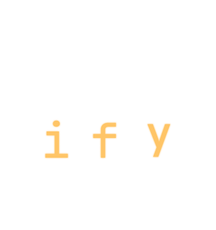

# ICSify

ICSify – Turn Your CSV into Calendar Magic!
A simple and efficient tool to convert CSV files into ICS calendar files for
Google Calendar.




# Features
- [x] Command-line friendly and easy to use
- [x] Convert CSV files into ICS format effortlessly
- [x] Supports custom date and time formats
- [x] Handles attribute details like Subject, Start Date, Start Time, End Date, Location, Description,
- [x] Handles recurrences`
- [x] Open-source and community-driven

# Installation
sh
Copy
Edit
pip install icsify  # If implemented in Python
# or
cargo install icsify  # If implemented in Rust
### Usage

```bash
Command Line
icsify input.csv email@example.com output.ics
```

```Python
python3 icsify.py input.csv email@example.com output.ics
```

# CSV Format
Your CSV should be structured like this:


```csv
Subject,Start Date,Start Time,End Date,End Time,Location,Description
Meeting with Team,20/03/25,14:00,20/03/25,15:00,Zoom,Discuss project updates
Doctor Appointment,22/03/25,10:30,22/03/25,11:00,Clinic,Regular check-up
```

### Example Output (ICS)

```
BEGIN:VCALENDAR
PRODID:-//Google Inc//Google Calendar 70.9054//EN
VERSION:2.0
CALSCALE:GREGORIAN
METHOD:PUBLISH
X-WR-CALNAME:example@example.com
X-WR-TIMEZONE:Europe/London]
BEGIN:VTIMEZONE
TZID:Europe/London
X-LIC-LOCATION:Europe/London
BEGIN:DAYLIGHT
TZOFFSETFROM:+0000
TZOFFSETTO:+0100
TZNAME:GMT+1
DTSTART:19700329T010000
RRULE:FREQ=YEARLY;BYMONTH=3;BYDAY=-1SU
END:DAYLIGHT
BEGIN:STANDARD
TZOFFSETFROM:+0100
TZOFFSETTO:+0000
TZNAME:GMT
DTSTART:19701025T020000
RRULE:FREQ=YEARLY;BYMONTH=10;BYDAY=-1SU
END:STANDARD
END:VTIMEZONE
BEGIN:VEVENT
DTSTART;TZID=Europe/London:20250320T140000
DTEND;TZID=Europe/London:20250320T150000
RRULE:FREQ=WEEKLY;UNTIL=20250406T235959Z
DTSTAMP:20250320T150000Z
UID:TjNTN0NhemhQYkc4cFN1Ug@google.com
CREATED:20250305T230249Z
LAST-MODIFIED:20250305T230249Z
LOCATION:Zoom
SEQUENCE:0
STATUS:CONFIRMED
SUMMARY:Meeting with Team
TRANSP:OPAQUE
END:VEVENT
BEGIN:VEVENT
DTSTART;TZID=Europe/London:20250322T103000
DTEND;TZID=Europe/London:20250322T110000
RRULE:FREQ=WEEKLY;UNTIL=20250406T235959Z
DTSTAMP:20250322T110000Z
UID:dWprUzdNM3A4Z0lneEFqdw@google.com
CREATED:20250305T230249Z
LAST-MODIFIED:20250305T230249Z
LOCATION:Clinic
SEQUENCE:0
STATUS:CONFIRMED
SUMMARY:Doctor Appointment
TRANSP:OPAQUE
END:VEVENT
END:VCALENDAR
```

# Contributing
Want to help improve ICSify? Contributions are welcome!!
- Simply create an issue with id `CONT-[Username]-[Contribution No.]`
- Fork Project
- Create a new branch (git checkout -b issue-name)
- Commit your changes (git commit -m "feat: new feature")
- Push to your branch (git push origin issue-name)
- Open a Pull Request / Create merge to `dev` for source repository
  - Merge Request name should be issue ID

# License
This project is licensed under the MIT License.